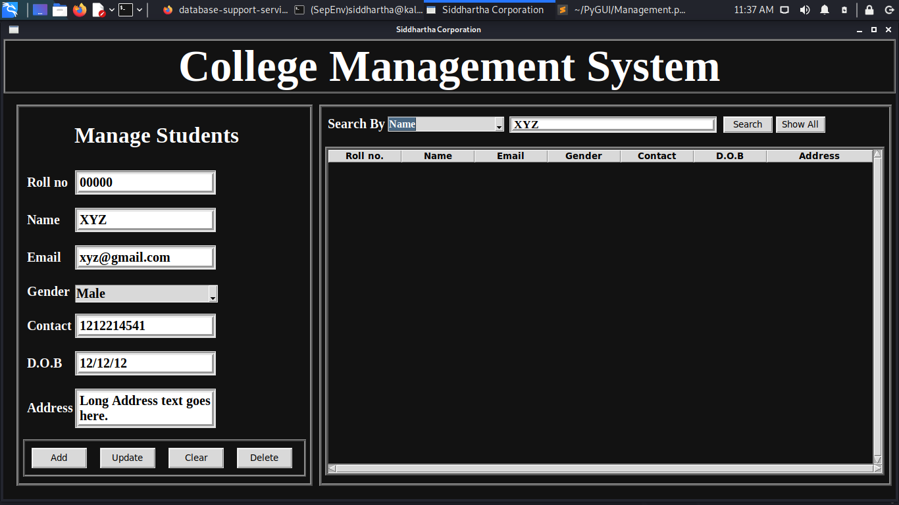

# Student Management System
<h3>A very simple Python GUI for Student Management System</h3> 
 Easy database Connectivity 
 
 Dark Theme  
 
 <h3>To Configure~</h3>
  <ul>
  <li>Buttons according to your need</li>
  <li>Database which you want</li>
  <li>Colors which you like</li>
</ul>

 
